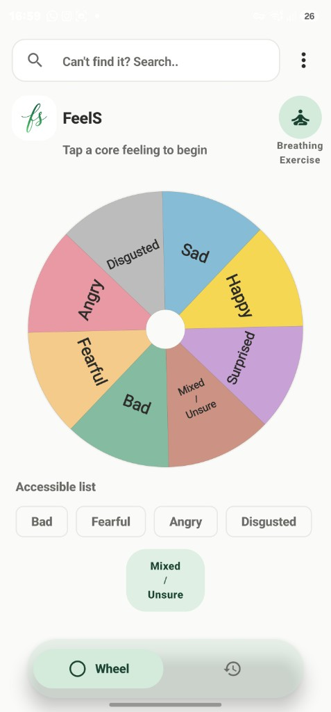
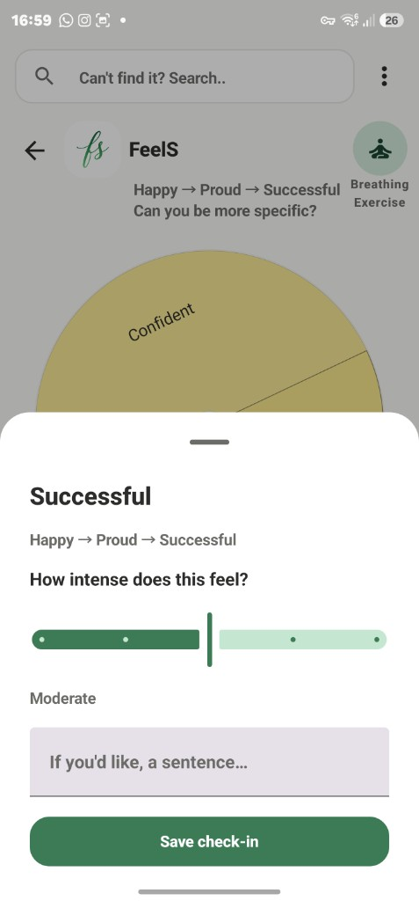
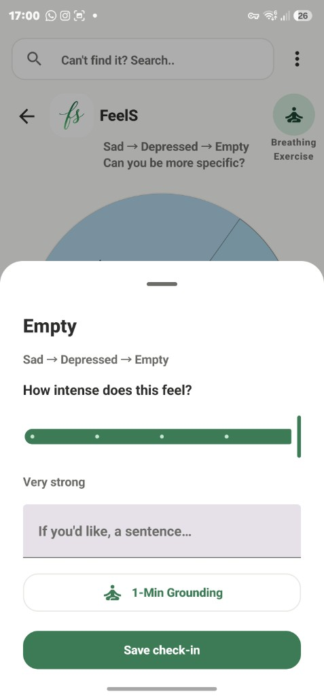
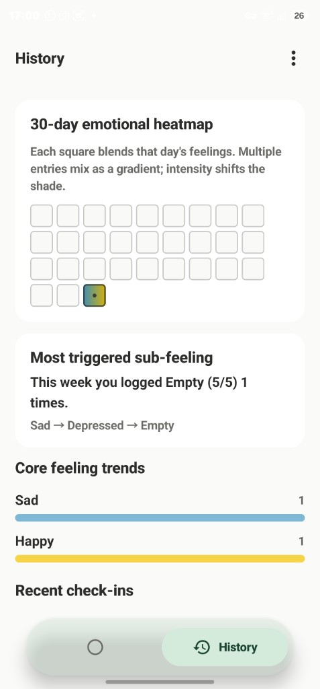
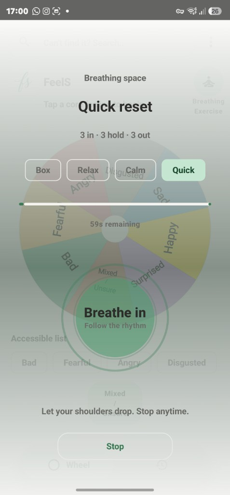
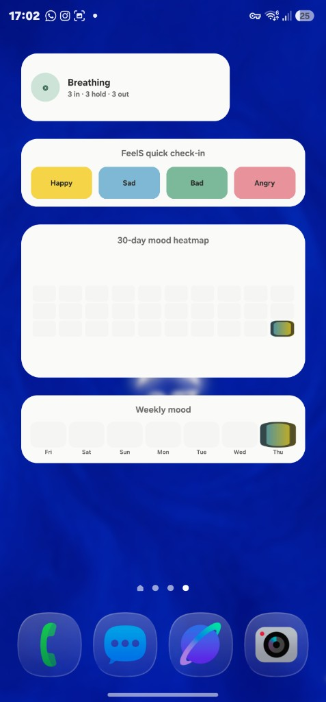
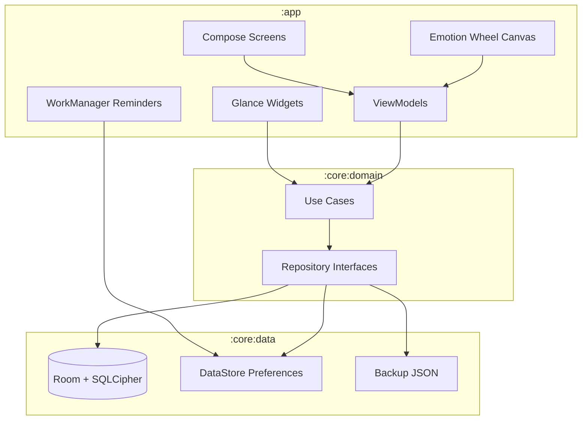

# FeelS

Interactive Feelings Wheel for Android. A local-first app to name how you feel,
log check-ins, and review patterns over time.

[](LICENSE)

| | |
|---|---|
| **Package** | `com.z3itt.feels` |
| **Version** | `1.0.0` |
| **Min SDK** | 26 (Android 8.0) |
| **Target SDK** | 35 |
| **License** | [GPL-3.0-or-later](LICENSE) |

FeelS is free software. You may study, modify, and redistribute it under the
terms of the GNU General Public License v3. See [LICENSE](LICENSE),
[COPYING](COPYING), [NOTICE](NOTICE), and [ATTRIBUTION.md](ATTRIBUTION.md).

## Highlights

- Spin a three-layer feelings wheel drawn with Jetpack Compose Canvas
- Log intensity, optional notes, and review a 30-day heatmap
- Home-screen widgets (quick check-in, heatmap, weekly mood, breathing)
- Encrypted on-device storage (Room + SQLCipher); no network access
- JSON export/import to move logs between devices
- Optional morning and evening check-in reminders

FeelS is a personal reflection tool, not medical care, diagnosis, or crisis
support.

## Screenshots

| Feelings wheel | Check-in |
|----------------|----------|
|  |  |

| Grounding check-in | History |
|--------------------|---------|
|  |  |

| Breathing | Home-screen widgets |
|-----------|---------------------|
|  |  |

## Architecture

FeelS uses Clean Architecture with three Gradle modules and MVVM in the app
layer.

```text
┌─────────────────────────────────────────────────────────────┐
│  :app                                                       │
│  Jetpack Compose UI · Canvas wheel · Glance widgets         │
│  ViewModels (MVVM) · Navigation · Notifications             │
└───────────────────────────┬─────────────────────────────────┘
                            │
┌───────────────────────────▼─────────────────────────────────┐
│  :core:domain                                               │
│  Models · repository interfaces · use cases                 │
└───────────────────────────┬─────────────────────────────────┘
                            │
┌───────────────────────────▼─────────────────────────────────┐
│  :core:data                                                 │
│  Room + SQLCipher · DataStore · backup JSON · Hilt modules  │
└─────────────────────────────────────────────────────────────┘

:core:ui — shared Material 3 theme tokens
```



### Key design choices

| Area | Approach |
|------|----------|
| UI | Jetpack Compose + Material 3; custom Canvas for the wheel |
| State | `StateFlow` / `SharedFlow` in ViewModels, collected in Compose |
| DI | Dagger Hilt (`@HiltViewModel`, `@Singleton` repositories) |
| Persistence | Room entities + SQLCipher passphrase from Android Keystore |
| Preferences | DataStore (theme, disclaimer, reminder times) |
| Background work | WorkManager one-shot chain for daily reminders |
| Widgets | Glance AppWidget + shared data loaders |
| Backup | kotlinx.serialization JSON, versioned format |

## Tech stack

| Layer | Libraries |
|-------|-----------|
| Language | Kotlin 2.0 |
| UI | Jetpack Compose, Material 3, Compose Navigation |
| Architecture | Clean Architecture, MVVM, Hilt |
| Database | Room 2.6, SQLCipher 4.5 |
| Async | Kotlin Coroutines, Flow |
| Storage | DataStore Preferences, Android Security Crypto |
| Widgets | Glance 1.2 |
| Background | WorkManager, Hilt Work |
| Build | AGP 8.7, KSP, R8 minify on release |

Full dependency versions: [`gradle/libs.versions.toml`](gradle/libs.versions.toml).

## Privacy and permissions

FeelS does **not** request `INTERNET`. Check-ins and notes stay on your device
in an encrypted database.

| Permission | Why |
|------------|-----|
| `POST_NOTIFICATIONS` | Optional daily check-in reminders |
| `VIBRATE` | Light haptic feedback on the wheel |

WorkManager may merge `RECEIVE_BOOT_COMPLETED`, `WAKE_LOCK`, and
`ACCESS_NETWORK_STATE` from its library manifest so reminders survive reboots.
FeelS does not upload data over the network.

## Getting started

### Requirements

- Android Studio Ladybug or newer (or compatible IDE)
- **JDK 17** for Gradle (Gradle 8.11.1 does not run on JDK 25)
- Android SDK with API 35 platform tools
- Device or emulator on API 26+

### Install (release)

Download the latest APK from
[GitHub Releases](https://github.com/z3itt/FeelS/releases).

### Clone and run (debug)

```bash
git clone https://github.com/z3itt/FeelS.git
cd FeelS
```

Open the project in Android Studio, set **Gradle JDK** to 17, sync, then Run.

Or from the terminal:

```bash
export JAVA_HOME="$HOME/.jdks/temurin-17.0.20.1"   # or your JDK 17 path
./gradlew :app:installDebug
```

### Tests

```bash
./gradlew :core:domain:testDebugUnitTest :core:data:testDebugUnitTest
```

See [CONTRIBUTING.md](CONTRIBUTING.md) for signed release builds and distribution
channels.

## Project layout

```text
app/                  Application module (UI, widgets, notifications)
core/domain/          Business rules and use cases
core/data/            Room, SQLCipher, DataStore, backup
core/ui/              Shared theme
fastlane/metadata/    F-Droid / store listing text
docs/screenshots/     README and store screenshots (add your images here)
```

## Contributing

FeelS is GPL-3.0. See [CONTRIBUTING.md](CONTRIBUTING.md) for setup, signing,
distribution, and pull request guidelines.

## Contact

- **Author:** z3itt
- **Email:** info@z3itt.com
- **Website:** https://z3itt.com
- **Source:** https://github.com/z3itt
